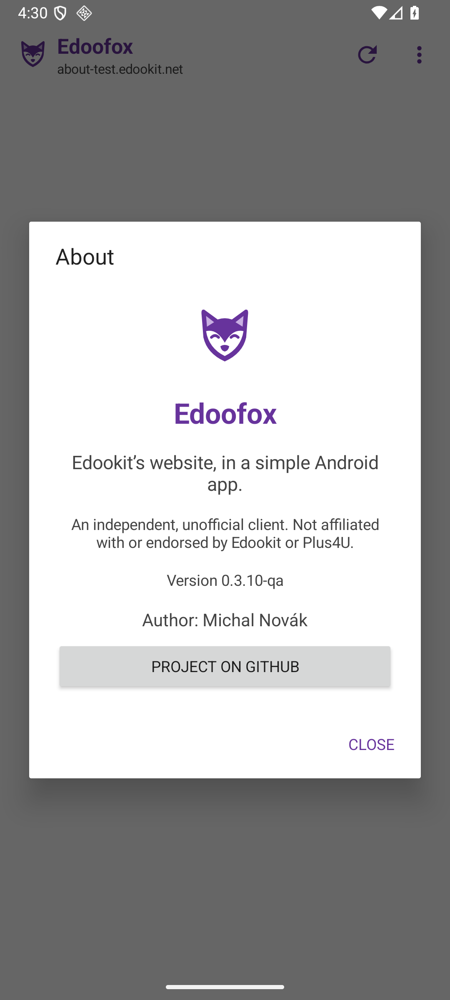

<h1> Edoofox</h1>

A small Android app that gives your school's Edookit website a home of its own.
Choose your school, sign in, and keep school messages a tap away.

**Edoofox is an independent, unofficial client. It is not affiliated with,
endorsed by, or supported by Edookit or Plus4U.** It displays their website;
it does not replace their service.

## Why another little app?

Dear Edookit, from one mildly outnumbered parent: please give us an official
Android app we can allow in Google Family Link. I would love to say
"yes to homework" without turning that into "yes to the entire browser."
Surely the school timetable can have its own little permission slip?

Until then, this fox is my homemade attempt: put the school website in a
separate app so a parent can try managing its availability alongside the
child's other apps. Built with affection, a little parental pleading, and
the hope that Edookit will eventually make it unnecessary.

The happiest ending for Edoofox is retirement: an official client that meets
this need would be a very welcome reason to deprecate it.

**This is a motivation, not a parental-control guarantee.** Edoofox does not
integrate with Family Link or bypass its restrictions. Installation and app
controls depend on the device and family settings. External links and downloads
can open other apps, which need their own parental controls.

## What it does

- Android 8.0 and newer; native Java UI with an Android WebView.
- Select a school's Edookit subdomain and switch schools from the menu.
- Sign in with **Plus4U email and password**. Google, Microsoft, Apple, and
  +4U Access sign-in are not currently supported in the app.
- Remember the school and browser session, subject to the website's own
  session-expiry rules.
- A compact menu with icons and Navigation, Page, and App groups.
- Back/Forward swipes, a fox shortcut to the menu, and deliberate pull-to-refresh.
  Normal scrolling never reveals the menu. Pull down starting at the top to
  reveal it; with the menu already open, a longer pull can refresh.
- Czech and English UI; Slovak devices use the Czech translation.
- No app-owned backend or analytics.

Notifications are not implemented. Downloads open in an external browser;
protected downloads and camera uploads are not verified. Website changes can
affect login and gesture behavior. See [privacy and limitations](docs/PRIVACY.md).



Screenshot from the isolated QA app using a fictional school; no account data.

## Install

Official APKs are intended to be distributed through
[GitHub Releases](https://github.com/mancze/edoofox/releases). If there is no
release yet, build from source or wait for the first published APK.

1. Download the versioned `edoofox-<version>-release.apk` release asset.
2. Open it on your phone and, if prompted, allow installation from that source.
3. Choose your school's subdomain and sign in using Plus4U email and password.

A supervised phone may require a parent's approval or may block sideloading.
Check the device's own controls; Edoofox cannot override them.

Install future official releases over the existing app to retain local data.
Updates must use the same signing key. A debug build or independently signed
fork cannot replace an official release with the same application ID.
Uninstalling removes locally stored settings and sessions.

The application ID is `cz.weborama.edoofox`, under the maintainer's weborama.cz
domain. This is a new installation compared with earlier development builds:
select your school and sign in again. Existing app data is not migrated.

## Build and contribute

No signing secrets or school account are needed to build the app.

```sh
git clone git@github.com:mancze/edoofox.git
cd edoofox
./gradlew :app:assembleDebug :app:testDebugUnitTest :app:lintDebug
```

On Windows, use `.\gradlew.bat`. Install the prerequisites first:
[development guide](docs/DEVELOPMENT.md).

- [Signing and GitHub release setup](docs/SIGNING.md)
- [Contributing and maintenance expectations](CONTRIBUTING.md)
- [Reporting security issues privately](SECURITY.md)
- [Publication audit](docs/PUBLICATION-AUDIT.md)
- [Historical validation notes](VALIDATION.md)

This is a spare-time parent project: small fixes are welcome, response times
are unpredictable, and there is no support SLA.

## License

Edoofox's original code and artwork are provided under the [MIT license](LICENSE).
Third-party tools retain their own licenses. Edookit/Plus4U names, services, and
web content are not licensed by this repository; see [notices](NOTICE.md).
